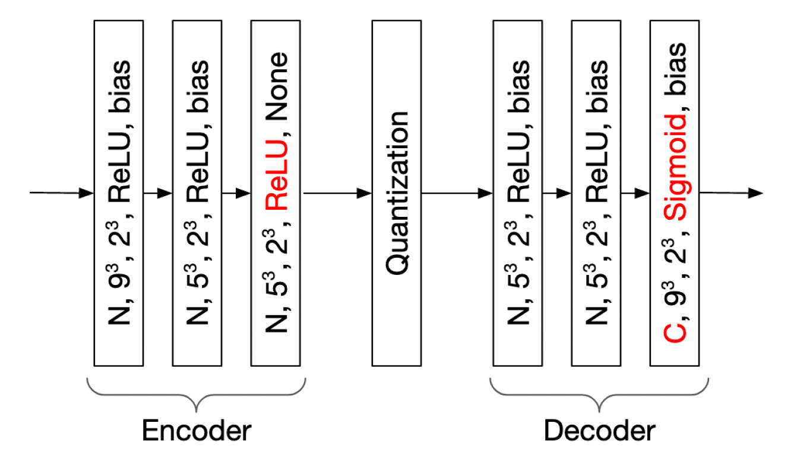

# Learning-based compression of point cloud geometry and color

This repository includes scripts for training and testing a neural network architecture for compression of geometry and color of point clouds. The compression model is based on a convolutional auto-encoder architecture that operates on block partitions of a point cloud. Since the network is exclusively composed of three dimensional convolutional layers, it doesn't fixate the resolution of the input blocks. However, due to memory constraints, the block size used during the training process is limited. 

The architecture of the model is represented on the figure below. 



This architecture correspond to the unified model's structure, where C is the number of output channels that can be set 1, 3 or 4. These values correspond to the cases where the compression model is used to encode geometry, color or geometry and color simultaneously. Adjusting this parameter allows for either the selection of an holistic representation of both dimensions, where both geometry and color are simultaneously fed to the network, or a sequential approach, where one model compresses the geometry and another encodes the color attributes.

For more details, the reader can refer to [1].

## Running the code

### Requirements 

The scripts contained in this repository require a number of python libraries to function. The list of requirements as well as their versions used for testing are listed below:

* Python 3.7
* Tensorflow 1.13.1
* PyntCloud 0.1.3
* Tqdm 4.55.1

### Running steps

The usage of the code should be done following these steps:

* Download a partial version of the HighResGC training and test dataset through FTP:

The  dataset can be downloaded from the following **FTP** by using dedicated FTP clients, such as FileZilla or FireFTP (we recommend to use [FileZilla](https://filezilla-project.org/)):

```
Protocol: FTP
FTP address: tremplin.epfl.ch
Username: datasets@mmspgdata.epfl.ch
Password: ohsh9jah4T
FTP port: 21
```

After you connect, choose the **partial_HighResGC** folder from the remote site, and download the relevant material. If desired, the user can refer to the section **Adding training or test data** in order to include additional point clouds to the training or test data. 

* Train the compression model with the downloaded dataset or select a pre-trained model. 

The user can run the script train.py in order to train the compression model given a set of parameters. The following command can be used to train the model from scratch:

```shell
python train.py 'path/to/training/set/*.ply' 'path/to/model/checkpoint' --resolution=64 --task=geometry+color --lmbda_g=2500 --lmbda_c=2500
```

Alternatively, a pre-trained model can be used to compress and decompress the test dataset. These models can be downloaded through FTP in the same address indicated above, in the folder **pcc_geo_color_pre_trained**.

* Compress and decompress the test set. 

The trained model can then be used to compress and decompress the test set. The following commands should be used for that purpose:

```shell
python compress.py 'path/to/test/set' '*.ply' 'path/to/compressed/blocks' 'path/to/model/checkpoint' --resolution=128 --task=geometry+color
```

```shell
python decompress.py 'path/to/test/set' '*.ply' 'path/to/compressed/blocks' '*.ply.bin' 'path/to/decompressed/blocks' 'path/to/model/checkpoint' --resolution=128 --task=geometry+color
```

* Merge the decompressed point cloud blocks. 

Finally, the decompressed blocks can be merged back to point clouds using the merge.py script:

```shell
python merge.py 'path/to/test/set' 'path/to/decompressed/blocks' 'path/to/merged/blocks' --resolution=128 --task=geometry+color
```

### Adding training or test data

In order to obtain the complete test dataset, the models *longdress*, *bumbameuboi* and *romanoillamp* can be downloaded at http://plenodb.jpeg.org/ from the sets "8i Voxelized Full Bodies" and "Univ. Sao Paulo Point Cloud dataset".

In order to use an external dataset for training or testing the model, the point clouds must be partitioned into non-overlapping cubic blocks. This task can be accomplished with the partition.py script, which can be executed with the following command:

```shell
python partition.py 'path/to/dataset/models' 'path/to/dataset/blocks' --block_size=64 --keep_size=500
```

The parameter *keep_size* indicates the minimum amount of points per block accepted by the partition method. This parameter was set to 500 to generate the provided training set and should be set to 0 when partitioning point cloud models for testing. An additional script is provided in order to select a random subset of the training set:

```shell
python sample_dataset.py 'path/to/dataset/blocks' 'path/to/sampled/dataset/blocks' --set_size=10000 
```

### Conditions of use

A large portion of the provided scripts are composed of code adpated from https://github.com/mauriceqch/pcc_geo_cnn [2].

If you wish to use any of the provided scripts in your research, we kindly ask you to cite [1].

### References

[1] Evangelos Alexiou, Kuan Tung, and Touradj Ebrahimi. 2020. “Towards Neural Network Approaches for Point Cloud Compression.” In *Applications of Digital Image Processing XLIII*, 11510:1151008. International Society for Optics and Photonics. https://doi.org/10.1117/12.2569115.https://doi.org/10.1109/ICMEW46912.2020.9106005)

[2] Maurice Quach, Giuseppe Valenzise, and Frederic Dufaux. 2019. “Learning Convolutional Transforms for Lossy Point Cloud Geometry Compression.” *2019 IEEE International Conference on Image Processing (ICIP)*, September, 4320–24. https://doi.org/10.1109/ICIP.2019.8803413.


In case of questions, please contact the following email address:

davi.nachtigalllazzarotto@epfl.ch